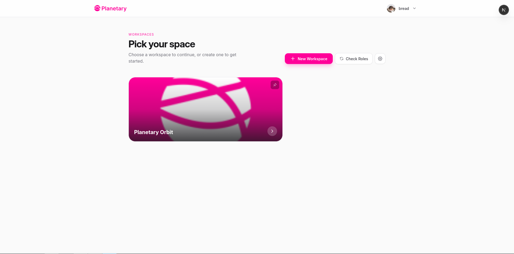
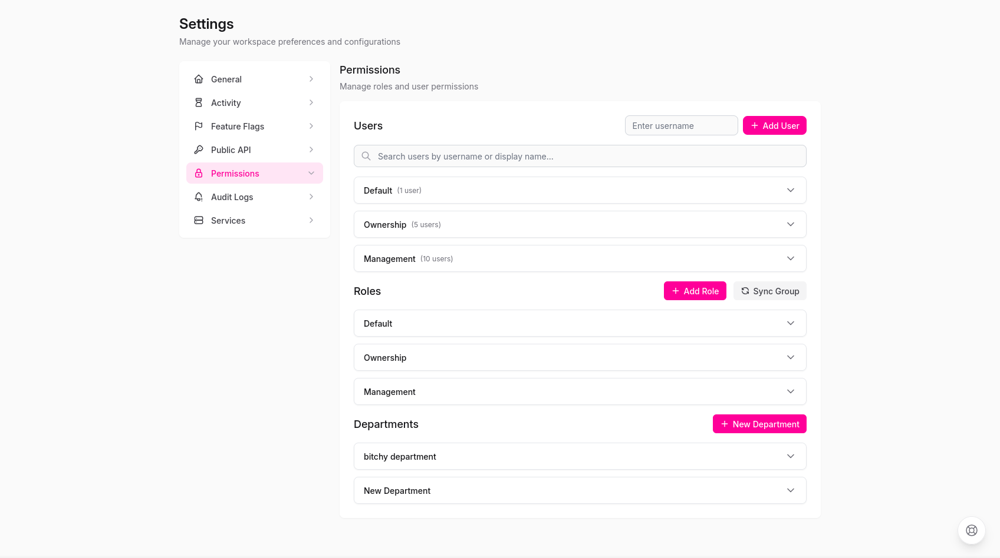
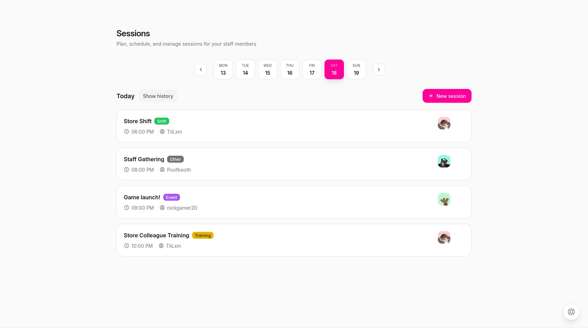
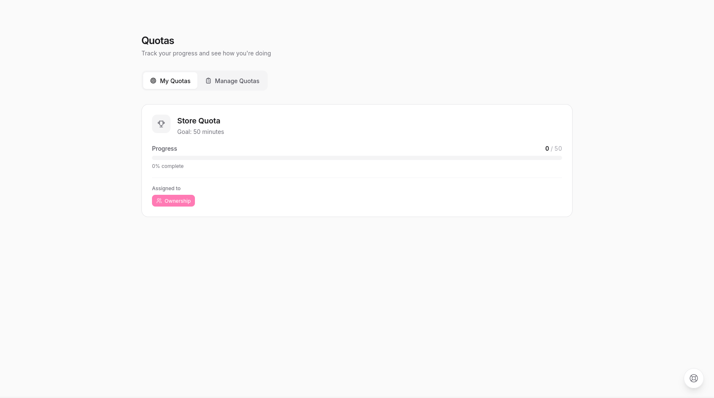
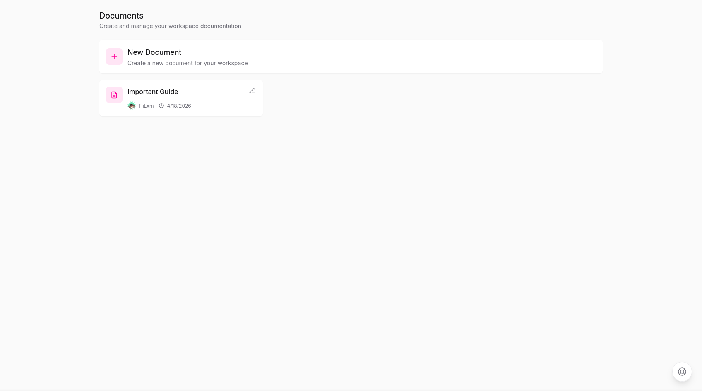
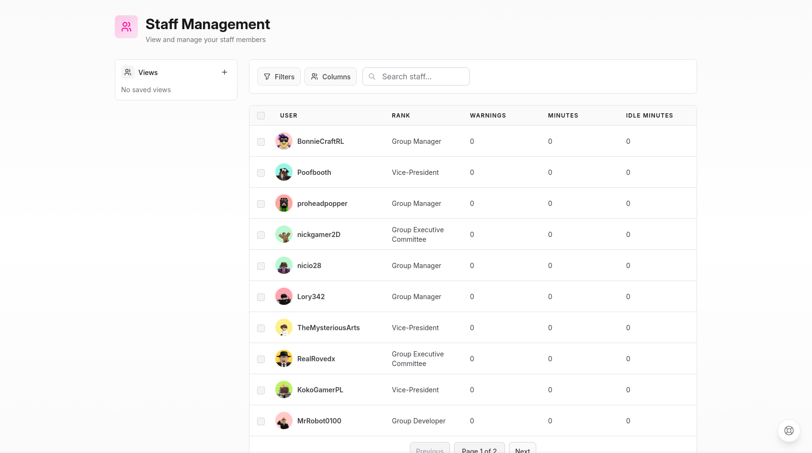
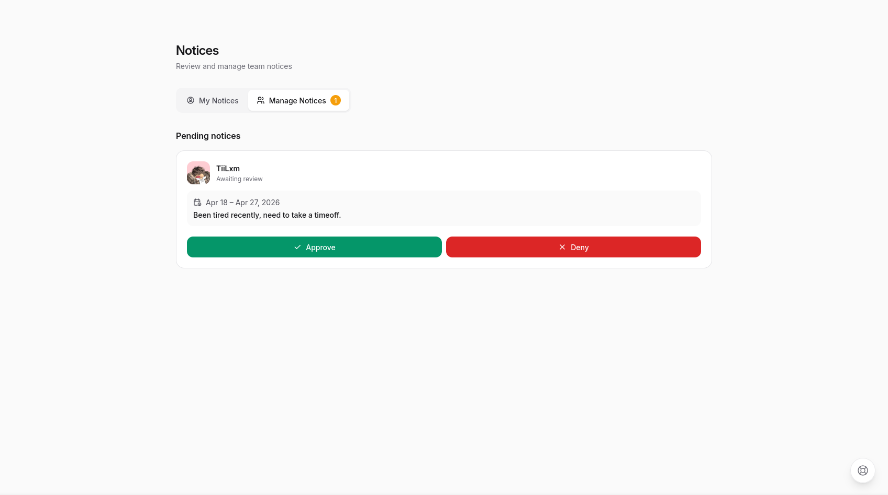
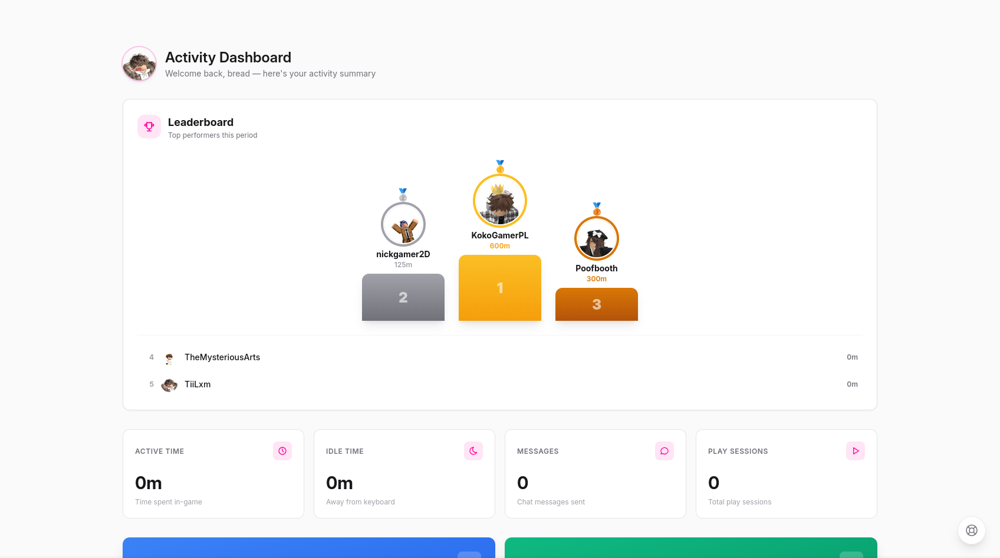

    

  
  
  
  
  
  

  <h1>Orbit</h1>
  
<strong>A modern, open-source staff management platform for Roblox groups — built and maintained by Team Planetary.</strong>

  <a href="https://planetaryapp.us">Website</a> ·
  <a href="https://docs.planetaryapp.us">Documentation</a> ·
  <a href="https://feedback.planetaryapp.us/bugs">Report a Bug</a> ·
  <a href="https://feedback.planetaryapp.us/changelog">Changelog</a> ·
  <a href="https://discord.com/invite/mWqdZmEkDc">Discord</a>

---

> [!NOTE]
> **Orbit is currently in beta.** We've resolved the critical issues present in Tovy and continue to ship improvements, but you may encounter bugs. Please [report any issues](https://feedback.planetaryapp.us/bugs) you find or submit a pull request.

---

## Table of Contents

- [Overview](#overview)
- [Features](#features)
- [Getting Started](#getting-started)
  - [Planetary Cloud (Recommended)](#planetary-cloud-recommended)
  - [One-Click Deploy to Vercel](#one-click-deploy-to-vercel)
  - [Self-Hosting](#self-hosting)
- [Screenshots](#screenshots)
- [Tech Stack](#tech-stack)
- [Contributing](#contributing)
- [License](#license)

---

## Overview

Orbit is a maintained and improved fork of [Tovy](https://github.com/tovyblox/tovy), the open-source staff management platform for Roblox. It gives group owners and staff teams the tools they need to manage members, run sessions, enforce policies, and track activity — all from a single, intuitive interface.

Team Planetary continues the original Tovy mission: keep the platform actively maintained, fix long-standing bugs, and introduce meaningful new features. Since forking, we have resolved critical issues that rendered Tovy unusable, refreshed the UI, added image support to the group wall, and launched Planetary Cloud — a free, one-click hosting solution built on a custom runtime.

---

## Features

Orbit ships with a comprehensive set of management tools out of the box:

| Category | Capabilities |
|---|---|
| **Member Management** | Warn, promote, demote, and bulk-manage group members |
| **Roles & Access** | Create custom roles, invite users, or sync directly with your Roblox group |
| **Activity Tracking** | Monitor member activity and enforce staff requirements |
| **Inactivity Notices** | Automatically track and flag inactive members |
| **Integrations** | Rank members via Orbit Integrations |
| **Communication** | Message members directly within Orbit; post to the group wall with image support |
| **Documentation** | Host your group's docs natively inside Orbit |
| **Policies** | Create and assign policy documents for members to review and sign |
| **Sessions** | Schedule and host sessions with minimal overhead |

---

## Getting Started

### Planetary Cloud (Recommended)

The fastest and easiest way to run Orbit is through **Planetary Cloud** — our free, managed hosting service. No configuration required.

👉 **[Get started at planetaryapp.us](https://planetaryapp.us)**

---

### One-Click Deploy to Vercel

> [!WARNING]
> **We strongly recommend using Planetary Cloud instead of Vercel.**
> 
> Vercel's serverless architecture introduces real limitations that affect Orbit's reliability — including cold starts, execution timeouts, and constraints on long-running processes like session handling and activity tracking. You may run into hard-to-debug issues that simply don't exist on Planetary Cloud.
>
> **[Planetary Cloud](https://planetaryapp.us) is free, purpose-built for Orbit, and works out of the box — no configuration needed.** We can't guarantee a great experience on Vercel, and support for Vercel-specific issues is limited.

Prefer to host on your own Vercel account? Deploy in seconds:

**Required environment variables:**

| Variable | Description |
|---|---|
| `SESSION_SECRET` | A strong secret string — generate with `openssl rand -base64 32` |
| `DATABASE_URL` | Your database connection string (e.g. [Supabase](https://supabase.com), [Railway](https://railway.app), [Neon](https://neon.tech)) |
| `NEXTAUTH_URL` | Your deployment URL, without a trailing slash (e.g. `https://instance.planetaryapp.cloud`) |
| `ROBLOX_WORKSPACE_REDIRECTID` | Your Roblox Group ID — users with workspace access will be redirected automatically |

---

### Self-Hosting

For full self-hosting instructions, refer to the [official documentation](https://docs.planetaryapp.us).

---

## Screenshots

 

<table>
  <tr>
    <td width="50%" valign="middle" align="left">
      <h3>🏠 Workspaces</h3>
      
Your central hub for everything. Workspaces give each group its own isolated environment — manage members, configure settings, and access all tools from one clean dashboard.

    </td>
    <td width="50%" valign="middle">
      
    </td>
  </tr>
</table>

 

<table>
  <tr>
    <td width="50%" valign="middle">
      
    </td>
    <td width="50%" valign="middle" align="left">
      <h3>🔐 Permissions & Role Management</h3>
      
Create fully custom roles with granular permission controls. Invite individual users or sync roles directly with your Roblox group — keeping your hierarchy consistent across both platforms.

    </td>
  </tr>
</table>

 

<table>
  <tr>
    <td width="50%" valign="middle" align="left">
      <h3>📅 Sessions</h3>
      
Schedule, host, and log sessions without the usual overhead. Session hosts can announce and manage events directly in Orbit, keeping everything in one place and your staff informed.

    </td>
    <td width="50%" valign="middle">
      
    </td>
  </tr>
</table>

 

<table>
  <tr>
    <td width="50%" valign="middle">
      
    </td>
    <td width="50%" valign="middle" align="left">
      <h3>📊 Quota Management</h3>
      
Assign activity quotas to staff roles and track progress in real time. Set weekly or monthly requirements and let Orbit handle the monitoring, so nothing slips through the cracks.

    </td>
  </tr>
</table>

 

<table>
  <tr>
    <td width="50%" valign="middle" align="left">
      <h3>📄 Documents</h3>
      
Host your group's documentation natively inside Orbit. Write, organise, and publish guides, handbooks, and policies — no external tool required.

    </td>
    <td width="50%" valign="middle">
      
    </td>
  </tr>
</table>

 

<table>
  <tr>
    <td width="50%" valign="middle">
      
    </td>
    <td width="50%" valign="middle" align="left">
      <h3>👥 Staff Management</h3>
      
Warn, promote, demote, and bulk-manage members with ease. Every action is logged, giving you a clear, auditable record of moderation history across your entire team.

    </td>
  </tr>
</table>

 

<table>
  <tr>
    <td width="50%" valign="middle" align="left">
      <h3>🔔 Notices</h3>
      
Let staff flag when they'll be away before it becomes a problem. Members submit inactivity notices directly in Orbit, and managers get a clear view of who's available and when.

    </td>
    <td width="50%" valign="middle">
      
    </td>
  </tr>
</table>

 

<table>
  <tr>
    <td width="50%" valign="middle">
      
    </td>
    <td width="50%" valign="middle" align="left">
      <h3>📈 Activity Tracking</h3>
      
Get a full picture of how your staff are performing. Track group activity over time, identify who's contributing, and make informed decisions about promotions and removals.

    </td>
  </tr>
</table>

---

## Tech Stack

Orbit is built with a modern, fully TypeScript stack:

- **Frontend:** [Next.js](https://nextjs.org), [TailwindCSS](https://tailwindcss.com)
- **Backend:** [Next.js API Routes](https://nextjs.org/docs/api-routes/introduction), [Prisma ORM](https://www.prisma.io)
- **Database:** Any Prisma-compatible database (PostgreSQL recommended)

---

## Contributing

Contributions are welcome and appreciated. Whether you're fixing a bug, improving documentation, or proposing a new feature, here's how to get involved:

1. **Fork** the repository and create a new branch from `main`.
2. **Make your changes**, following the existing code style.
3. **Test** your changes locally before submitting.
4. **Open a Pull Request** with a clear description of what you've changed and why.

For bug reports and feature requests, please use our [feedback portal](https://feedback.planetaryapp.us/bugs). For questions and discussion, join our [Discord server](https://discord.com/invite/mWqdZmEkDc).

---

## License

Orbit is licensed under the [GNU General Public License v3.0](./LICENSE). You are free to use, modify, and distribute this software under the terms of that license.

---

  Built with ❤️ by <a href="https://planetaryapp.us">Team Planetary</a>

